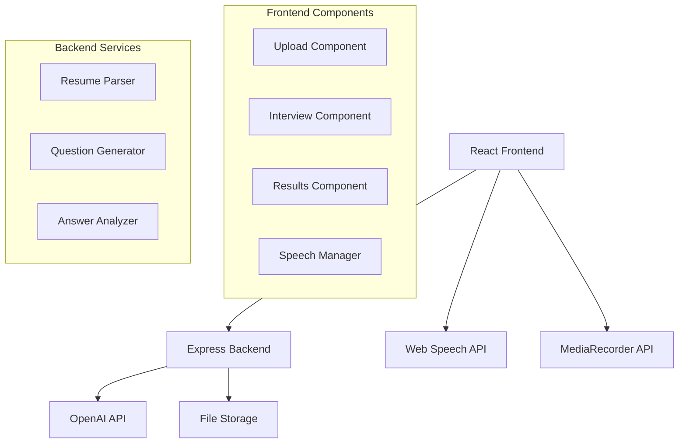

# Design Document

## Overview

The Smart Interview Prep application is a web-based system that provides an interactive interview practice experience. The system consists of a React frontend and Node.js backend, integrating multiple APIs for resume parsing, AI question generation, text-to-speech, speech recognition, and answer analysis.

The application follows a stateless architecture where interview sessions are managed client-side, with the backend providing API services for file processing and AI interactions.

## Architecture

### High-Level Architecture



### Technology Stack

**Frontend:**
- React 18 with Vite for fast development
- Material-UI for consistent UI components
- Web Speech API for text-to-speech (SpeechSynthesis)
- Web Speech API for speech recognition (SpeechRecognition)
- MediaRecorder API for audio recording fallback
- Axios for HTTP client

**Backend:**
- Node.js with Express framework
- Multer for file upload handling
- pdf-parse for PDF text extraction
- mammoth for DOCX text extraction
- OpenAI API for question generation and answer analysis
- Local file storage for uploaded resumes

## Components and Interfaces

### Frontend Components

#### 1. UploadComponent
**Purpose:** Handle resume upload and parsing
**Props:** 
- `onParseComplete: (resumeData) => void`
- `onError: (error) => void`

**State:**
- `uploading: boolean`
- `parsing: boolean`
- `resumeData: ResumeData | null`

#### 2. InterviewComponent
**Purpose:** Manage interactive interview session
**Props:**
- `questions: Question[]`
- `onSessionComplete: (session) => void`

**State:**
- `currentQuestionIndex: number`
- `isPlaying: boolean`
- `isRecording: boolean`
- `answers: Answer[]`
- `sessionActive: boolean`

#### 3. ResultsComponent
**Purpose:** Display interview results and AI feedback
**Props:**
- `session: InterviewSession`
- `onRestart: () => void`

#### 4. SpeechManager (Service)
**Purpose:** Centralized speech functionality management
**Methods:**
- `speak(text: string): Promise<void>`
- `startRecording(): Promise<void>`
- `stopRecording(): Promise<string>`
- `checkBrowserSupport(): SpeechSupport`

### Backend API Endpoints

#### POST /api/resume
**Purpose:** Parse uploaded resume file
**Request:** FormData with file
**Response:**
```typescript
interface ResumeData {
  text: string;
  skills: string[];
  experience: string;
  education: string[];
  projects: Project[];
  raw?: any;
}
```

#### POST /api/questions
**Purpose:** Generate interview questions
**Request:**
```typescript
interface QuestionRequest {
  role: string;
  level: 'fresher' | 'intermediate' | 'experienced';
  resumeSummary: ResumeData;
}
```
**Response:**
```typescript
interface QuestionResponse {
  intro: string;
  roleQuestions: string[];
  openEnded: string[];
  metadata: { promptUsed: string };
}
```

#### POST /api/analyze-answers
**Purpose:** Analyze user answers and provide feedback
**Request:**
```typescript
interface AnalysisRequest {
  questions: string[];
  answers: string[];
  role: string;
  level: string;
}
```
**Response:**
```typescript
interface AnalysisResponse {
  feedback: QuestionFeedback[];
  overallScore: number;
  summary: string;
  improvements: string[];
}
```

## Data Models

### Core Data Types

```typescript
interface ResumeData {
  text: string;
  skills: string[];
  experience: string;
  education: string[];
  projects: Project[];
}

interface Project {
  title: string;
  summary: string;
  technologies?: string[];
}

interface Question {
  id: string;
  type: 'intro' | 'role' | 'openEnded';
  text: string;
  order: number;
}

interface Answer {
  questionId: string;
  transcription: string;
  audioBlob?: Blob;
  timestamp: Date;
}

interface InterviewSession {
  id: string;
  questions: Question[];
  answers: Answer[];
  role: string;
  level: string;
  startTime: Date;
  endTime?: Date;
}

interface QuestionFeedback {
  questionId: string;
  score: number; // 1-10
  feedback: string;
  suggestions: string[];
  keyPoints: string[];
}

interface SpeechSupport {
  synthesis: boolean;
  recognition: boolean;
  mediaRecorder: boolean;
}
```

## Error Handling

### Frontend Error Handling

1. **Speech API Errors:**
   - Graceful degradation when speech APIs unavailable
   - Fallback to text-only mode
   - Clear user messaging about browser compatibility

2. **Network Errors:**
   - Retry mechanisms for API calls
   - Offline state detection
   - User-friendly error messages

3. **File Upload Errors:**
   - File size validation (max 10MB)
   - File type validation (PDF, DOCX only)
   - Clear error messaging

### Backend Error Handling

1. **File Processing Errors:**
   - Corrupted file detection
   - Unsupported format handling
   - Parsing failure recovery

2. **OpenAI API Errors:**
   - Rate limiting handling
   - API key validation
   - Response validation and sanitization

3. **Server Errors:**
   - Comprehensive logging
   - Graceful error responses
   - Request validation

## Speech Integration Design

### Text-to-Speech Implementation

```typescript
class SpeechSynthesisManager {
  private synthesis: SpeechSynthesis;
  private currentUtterance: SpeechSynthesisUtterance | null = null;

  async speak(text: string): Promise<void> {
    return new Promise((resolve, reject) => {
      if (!this.isSupported()) {
        reject(new Error('Speech synthesis not supported'));
        return;
      }

      this.currentUtterance = new SpeechSynthesisUtterance(text);
      this.currentUtterance.onend = () => resolve();
      this.currentUtterance.onerror = (event) => reject(event.error);
      
      this.synthesis.speak(this.currentUtterance);
    });
  }

  stop(): void {
    if (this.synthesis.speaking) {
      this.synthesis.cancel();
    }
  }
}
```

### Speech Recognition Implementation

```typescript
class SpeechRecognitionManager {
  private recognition: SpeechRecognition | null = null;
  private mediaRecorder: MediaRecorder | null = null;

  async startRecording(): Promise<void> {
    if (this.isSpeechRecognitionSupported()) {
      return this.startSpeechRecognition();
    } else {
      return this.startAudioRecording();
    }
  }

  private async startSpeechRecognition(): Promise<string> {
    return new Promise((resolve, reject) => {
      this.recognition = new (window.SpeechRecognition || window.webkitSpeechRecognition)();
      this.recognition.continuous = true;
      this.recognition.interimResults = false;
      
      this.recognition.onresult = (event) => {
        const transcript = event.results[event.results.length - 1][0].transcript;
        resolve(transcript);
      };
      
      this.recognition.onerror = (event) => reject(event.error);
      this.recognition.start();
    });
  }
}
```

## Testing Strategy

### Unit Testing
- **Frontend:** Jest + React Testing Library
  - Component rendering and interaction
  - Speech API mocking and error scenarios
  - State management testing

- **Backend:** Jest + Supertest
  - API endpoint testing
  - File parsing logic
  - OpenAI integration mocking

### Integration Testing
- End-to-end user flows with Playwright
- Speech API integration testing
- File upload and processing workflows
- Cross-browser compatibility testing

### Performance Testing
- Large resume file processing
- Speech synthesis performance
- Memory usage during long interview sessions
- API response time optimization

## Security Considerations

1. **File Upload Security:**
   - File type validation on both client and server
   - File size limits enforcement
   - Virus scanning for uploaded files
   - Temporary file cleanup

2. **API Security:**
   - OpenAI API key protection
   - Rate limiting implementation
   - Input sanitization and validation
   - CORS configuration

3. **Privacy:**
   - No persistent storage of personal data
   - Audio data handled client-side only
   - Resume content not logged
   - Clear data retention policies

## Browser Compatibility

### Speech API Support
- **Chrome/Edge:** Full support for both synthesis and recognition
- **Firefox:** Synthesis supported, recognition limited
- **Safari:** Synthesis supported, recognition not supported
- **Mobile browsers:** Limited support, graceful degradation required

### Fallback Strategies
1. **No Speech Synthesis:** Display questions as text with manual progression
2. **No Speech Recognition:** Provide text input for answers
3. **No MediaRecorder:** Use basic text input only
4. **Older Browsers:** Progressive enhancement approach

## Performance Optimization

1. **Frontend:**
   - Lazy loading of speech components
   - Audio blob compression
   - Efficient state management
   - Component memoization

2. **Backend:**
   - Resume parsing caching
   - OpenAI response caching for identical inputs
   - File processing optimization
   - Memory management for large files

3. **Network:**
   - Request debouncing
   - Compression for API responses
   - CDN for static assets
   - Progressive loading strategies